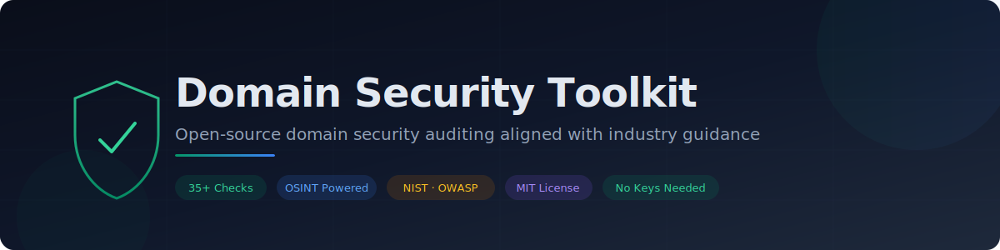
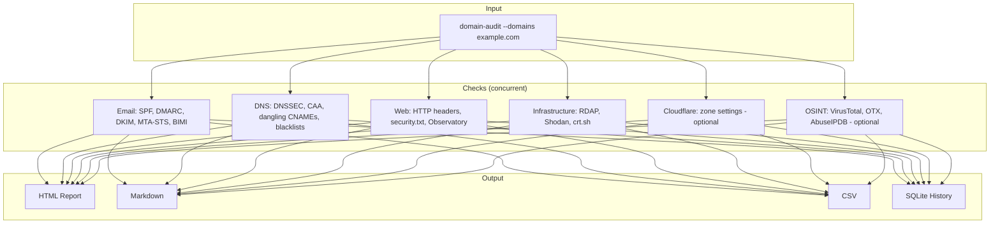
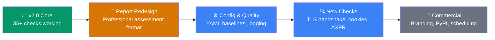

<p align="center">
  
</p>

<p align="center">
  <a href="https://wellbelove.org/domain-security-toolkit/"><strong>View the project page</strong></a>
</p>

<p align="center">
  <a href="https://www.python.org/downloads/"></a>
  <a href="https://github.com/wblv-dev/domain-security-toolkit/actions"></a>
  <a href="LICENSE"></a>
</p>

<p align="center">
  <a href="#quick-start">Quick start</a> ·
  <a href="#what-it-checks">What it checks</a> ·
  <a href="#what-you-get">Report output</a> ·
  <a href="#all-cli-options">CLI reference</a> ·
  <a href="#optional-osint-enrichment">OSINT enrichment</a> ·
  <a href="#troubleshooting">Troubleshooting</a>
</p>

---

### Without this tool
> Run MXToolbox for email, SSL Labs for TLS, Mozilla Observatory for headers, crt.sh for certificates, Shodan for ports, WHOIS for registration... then manually compile findings into a spreadsheet or document.

### With this tool
> ```
> pip install git+https://github.com/wblv-dev/domain-security-toolkit
> domain-audit --domains example.com
> ```
> Open `audit_report.html`. Done.

One command. 35+ checks. Professional report with prioritised findings, step-by-step remediation guidance, and references to relevant NIST, OWASP, NCSC, CISA, and GDPR recommendations.

No API keys. No accounts. No configuration.

---

## Quick start

### 1. Install

**You need [Python 3.10+](https://www.python.org/downloads/)** (Windows: search "Python" in the Microsoft Store).

Then one command:

```bash
pip install git+https://github.com/wblv-dev/domain-security-toolkit
```

That's it. No cloning, no virtual environments, no build steps.

<details>
<summary>Alternative: install from source (for development/contributing)</summary>

```bash
git clone https://github.com/wblv-dev/domain-security-toolkit
cd domain-security-toolkit
python3 -m venv .venv
source .venv/bin/activate    # Windows: .venv\Scripts\Activate.ps1
pip install -e .
```
</details>

### 2. Audit

```bash
domain-audit --domains yourdomain.com
```

> **Windows: `domain-audit` not found?** Use `python -m domain_audit --domains yourdomain.com` instead — this always works regardless of PATH.

**Multiple domains from a file** (one per line — ideal for large audits):
```bash
domain-audit --domains-file my-domains.txt
```

That's it. Open `audit_report.html` in your browser.

---

## What you get

```
$ domain-audit --domains example.com

[3/7] Running live DNS and HTTP checks ...
  [EMAIL] example.com: SPF=PASS  DMARC=PASS
  [DNSSEC] example.com: PASS
  [WEB] example.com: 4/6 headers, security.txt=PASS
  [SHODAN] example.com: PASS (2 ports, 0 CVEs)
  [OBSERVATORY] example.com: B+ (score: 70)
  [CT] example.com: 12 certs, 5 subdomains
[7/7] Summary
============================================================
  example.com     SPF:PASS  DMARC:PASS  DNSSEC:PASS  Headers:4/6

  Reports: audit_report.html, AUDIT_REPORT.md, audit_report.csv
```

| Output file | What it's for |
|-------------|--------------|
| **`audit_report.html`** | Interactive dashboard with charts, clickable findings, remediation steps, and standards references. **Send this to customers.** Print as PDF with Ctrl+P. |
| `AUDIT_REPORT.md` | Same findings in Markdown — for Git repos or documentation. |
| `audit_report.csv` | One row per domain — open in Excel/Sheets. |
| `audit_history.db` | SQLite database — accumulates across runs for trend tracking. |

---

## What it checks

<table>
<tr><td>

**✉️ Email security**
- SPF record + grading
- DMARC policy + grading
- DKIM (10 selectors)
- MTA-STS
- TLSRPT
- BIMI

</td><td>

**🔐 DNS security**
- DNSSEC validation
- CAA records
- Dangling CNAMEs
- DNSBL blacklists (6 lists)
- Reverse DNS (FCrDNS)

</td><td>

**🌐 Web security**
- X-Frame-Options
- Content-Security-Policy
- X-Content-Type-Options
- Referrer-Policy
- Permissions-Policy
- HSTS (HTTP header)
- security.txt (RFC 9116)
- Mozilla Observatory grade

</td></tr>
<tr><td>

**🏗️ Infrastructure**
- Domain expiry (RDAP)
- Transfer lock status
- Open ports + CVEs (Shodan)
- Certificate Transparency
- Technology fingerprint

</td><td>

**☁️ Cloudflare** *(optional)*
- SSL mode
- TLS version
- HSTS, HTTPS redirect
- Security level
- Browser Integrity Check
- +6 more zone settings

</td><td>

**📋 Standards**

Every finding cites:
- NIST SP 800-52/177/81
- OWASP Secure Headers
- NCSC UK guidance
- CISA BOD 18-01
- PCI DSS v4.0
- GDPR Article 32
- NIS2, BSI, ENISA

</td></tr>
</table>

---

## How it works

The tool runs all checks concurrently against each domain, grades every finding against published standards, then generates the reports. All checks are read-only — nothing is modified.

<details>
<summary><strong>Architecture (for developers/contributors)</strong></summary>



Checks are declarative — adding a new one is a dict, not new logic:

```python
{
    "setting":     "browser_check",
    "label":       "Browser Integrity Check",
    "recommended": "on",
    "values_pass": {"on"},
    "values_fail": {"off"},
    "explanation":  "Blocks requests with suspicious HTTP headers.",
}
```

Grading, remediation guidance, standards citations, and report output all flow automatically from the check definition.
</details>

---

## Optional: OSINT enrichment

The tool works fully without any API keys. For deeper intelligence, set any of these — all have free tiers:

| Service | Env var | Free tier | What it adds |
|---------|---------|-----------|-------------|
| [VirusTotal](https://www.virustotal.com/gui/join-us) | `VIRUSTOTAL_KEY` | 500/day | Reputation from 70+ engines |
| [AlienVault OTX](https://otx.alienvault.com/) | `OTX_KEY` | 10K/hr | Threat intelligence feeds |
| [AbuseIPDB](https://www.abuseipdb.com/register) | `ABUSEIPDB_KEY` | 1K/day | IP abuse scoring |
| [Shodan](https://account.shodan.io/register) | `SHODAN_API_KEY` | 100/month | Detailed port/service data |
| [URLhaus](https://auth.abuse.ch/) | `URLHAUS_KEY` | Fair use | Malware URL checking |
| [Google Safe Browsing](https://developers.google.com/safe-browsing/) | `GOOGLE_SAFEBROWSING_KEY` | 10K+/day | Phishing/malware flagging |

```bash
# macOS / Linux
export VIRUSTOTAL_KEY="your_key"
domain-audit --domains example.com

# Windows (PowerShell)
$env:VIRUSTOTAL_KEY="your_key"
domain-audit --domains example.com
```

---

## Optional: Cloudflare integration

Not required. Adds 11 zone security checks when provided.

1. [Cloudflare dashboard](https://dash.cloudflare.com/) → **My Profile** → **API Tokens** → **Create Token**
2. Permissions: **Zone → Zone → Read** and **Zone → DNS → Read**

```bash
domain-audit --domains example.com --cloudflare-token YOUR_TOKEN
```

---

## All CLI options

```
domain-audit --domains DOMAIN [DOMAIN ...]   Domains to audit
             --domains-file FILE              Load domains from file (one per line)
             --cloudflare-token TOKEN         Cloudflare API token (optional)
             --output-dir DIR                 Where to save reports (default: .)
             --format {html,md,csv}           Which reports (default: all)
             --concurrency N                  Parallel domains (default: 20)
             --verbose                        Debug output
             --log-file FILE                  Save log to file
             --no-diff                        Skip previous-run comparison

domain-dashboard                              Interactive data explorer (Datasette)
```

**Exit codes:** `0` = pass/warn · `1` = error · `2` = at least one FAIL

---

## Troubleshooting

| Problem | Fix |
|---------|-----|
| `domain-audit: command not found` | Ensure pip install completed successfully. Try `python -m domain_audit --domains example.com` as a fallback. |
| `pip: command not found` | Install Python first — see [step 1](#1-install) |
| `pip install` fails with permission error | Use `pip install --user git+https://...` or run in a virtual environment |
| Report looks broken | Open in Chrome, Firefox, or Edge (not Internet Explorer) |
| Slow on many domains | `domain-audit --domains ... --concurrency 10` |
| Crash or unexpected error | Check `domain-audit-error.log` — attach it when opening a [GitHub issue](https://github.com/wblv-dev/domain-security-toolkit/issues) |

---

## FAQ

<details>
<summary><strong>Do I need a Cloudflare account?</strong></summary>
No. Cloudflare is optional. 25+ checks work against any domain without any API keys.
</details>

<details>
<summary><strong>Can I audit domains I don't own?</strong></summary>
Yes. All checks use publicly available data (DNS records, HTTP headers, certificate transparency logs, RDAP). This is standard OSINT.
</details>

<details>
<summary><strong>Is this tool free?</strong></summary>
Yes. MIT licensed. Free to use, modify, and distribute — including commercially.
</details>

<details>
<summary><strong>How is this different from MXToolbox / Hardenize / SecurityScorecard?</strong></summary>
Those are web-based SaaS tools ($0-$26K/year). This is a CLI that produces a self-contained HTML report you can send to anyone. It also cites regulatory standards (NIST, OWASP, NCSC, GDPR) in every finding — most tools don't.
</details>

<details>
<summary><strong>Can I run this on a schedule?</strong></summary>
Yes. It's a CLI with exit codes — set up a cron job or scheduled task. Exit code 2 means failures were found.
</details>

---

## Roadmap



| Phase | Status | Key items |
|-------|--------|-----------|
| **v2.0 Core** | ✅ Done | 35+ checks, CLI, HTML/MD/CSV reports, standards mapping, OSINT integrations |
| **Report redesign** | 🔨 Next | Professional security assessment format — cover page, executive summary, one-page scorecard, methodology section, plain English findings |
| **Configuration** | Planned | YAML config for checks/standards (non-developers can update baselines), migrate print→logger |
| **New checks** | Planned | TLS handshake (cert expiry, chain, protocols), AXFR zone transfer, cookie security, SPF lookup count, CORS, NS redundancy, CSP quality, Spamhaus DBL |
| **Features** | Planned | `--include-subdomains`, IP address input, progress bar, phishing risk score, cyber insurance checklist |
| **Commercial** | Planned | White-label/branded reports, PyPI publishing, GitHub Actions scheduled audits |

See [full roadmap](https://github.com/wblv-dev/domain-security-toolkit/issues) for details.

---

## Contributing

Issues and pull requests welcome.

## License

[MIT](LICENSE)

---

<div align="center">
<sub>Built with Python · Checks aligned with NIST, OWASP, NCSC, CISA, and GDPR guidance</sub>
</div>
